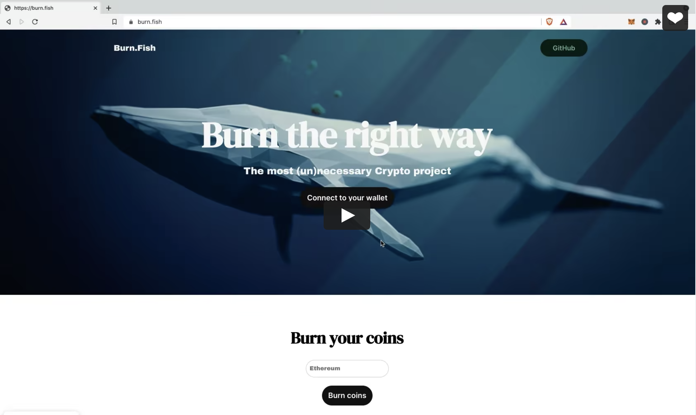

<!-- PROJECT LOGO -->
 

  <a href="https://burn.fish/">
    <h1>Burn.Fish</h1>
  </a>
  

    <strong>Burn ETH the right way</strong>
     
     
    <a href="https://vimeo.com/651384884/ee23bfbda3">View Demo</a>
    ·
    <a href="https://github.com/zeev1079/Burn.Fish/issues">Report Bug</a>
    ·
    <a href="https://github.com/zeev1079/Burn.Fish/issues">Request Feature</a>
  

<!-- TABLE OF CONTENTS -->

  
Table of Contents

  <ol>
    <li>
      <a href="#about-the-project">About The Project</a>
      <ul>
        <li><a href="#built-with">Built With</a></li>
      </ul>
    </li>
    <li><a href="#Demo">Demo</a></li>
    <li><a href="#getting-started">Getting Started</a></li>
    <li><a href="#contributing">Contributing</a></li>
    <li><a href="#license-&-Disclaimer">License</a></li>
    <li><a href="#contact">Contact</a></li>
    <li><a href="#acknowledgments">References</a></li>
  </ol>

<!-- ABOUT THE PROJECT -->
## About The Project

<strong>Burn.fish</strong> is a simple tool to burn ethers the right way, using a self-destructed contract that sends ethers to itself.

There are many reasons to burn your coins (<a href="https://www.investopedia.com/terms/p/proof-burn-cryptocurrency.asp">Proof of Burn</a>),
yet the most common way to burn coins is by sending to a <a href="https://etherscan.io/address/0x0000000000000000000000000000000000000000">'dead' wallet</a>(some have over billion dollars worth of tokens), which is not the right way...

Here's why:
* There is no way to verify the 'dead' wallet private key was actually destroyed
* A 'dead' wallet is like a super valuable and secure* safe in Times Square, where everyone is trying to break into
* Why worry about the small probability of a dead wallet becoming undead

By using a self-destructed contract (Burn.Fish), the ETH vanishes completely where the address of the contract no longer has any balance or code!!

### Built With

* [Scala.js](https://www.scala-js.org/)
* [Ethers.js](https://docs.ethers.io/v5/)  
* [Vue.js](https://vuejs.org/)
* [Aspect.app](https://aspect.app/)
* [Pages.github](https://pages.github.com/)
  

(<a href="#top">back to top</a>)

## Demo

<!-- GETTING STARTED -->
## Getting Started
To use the site you will need to install <a href="https://metamask.io/download">MetaMask</a>.

Connect to your MetaMask, and then burn some ether. 

<strong>Alternatively</strong> you can also deploy the Burn.Fish <a href="https://github.com/zeev1079/Burn.Fish/blob/main/contracts/BurnFish.sol">Contract</a> manually  

(<a href="#top">back to top</a>)

<!-- CONTRIBUTING -->
## Contributing

If you have a suggestion that would make this better, please fork the repo and create a pull request. You can also simply open an issue with the tag "enhancement".
Don't forget to give the project a star! Thanks again!

1. Fork the Project
2. Create your Feature Branch (`git checkout -b feature/AmazingFeature`)
3. Commit your Changes (`git commit -m 'Add some AmazingFeature'`)
4. Push to the Branch (`git push origin feature/AmazingFeature`)
5. Open a Pull Request

(<a href="#top">back to top</a>)

<!-- LICENSE -->
## License & Disclaimer

Distributed under the MIT License. See `LICENSE` for more information.

This is entirely for educational purpose. Use at your own risk and responsibility.

(<a href="#top">back to top</a>)

<!-- CONTACT -->
## Contact

Twitter - [@BurnFishEth](https://twitter.com/BurnFishETH)

(<a href="#top">back to top</a>)

<!-- ACKNOWLEDGMENTS -->
## References

Whale image was taken from <a href="https://pixabay.com/illustrations/blue-whale-animal-water-nature-3158626/">pixabay</a> created/published by <a href="https://pixabay.com/users/torulus-7457760/">@Torulus</a>

Please reach out if the image should be removed for any reason.

(<a href="#top">back to top</a>)

